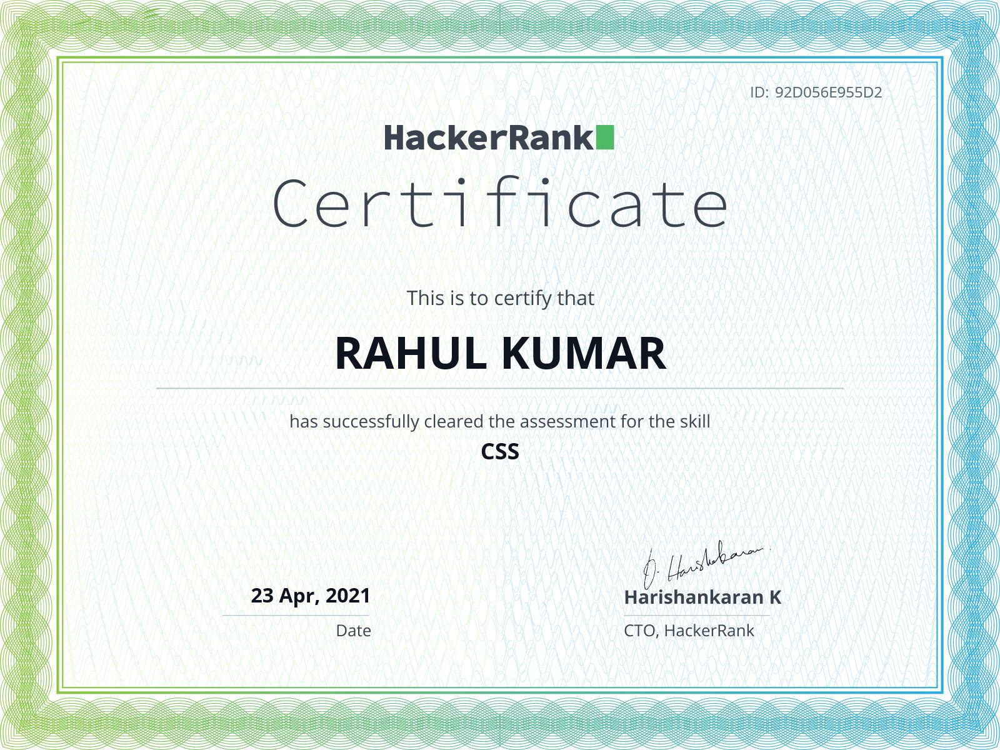
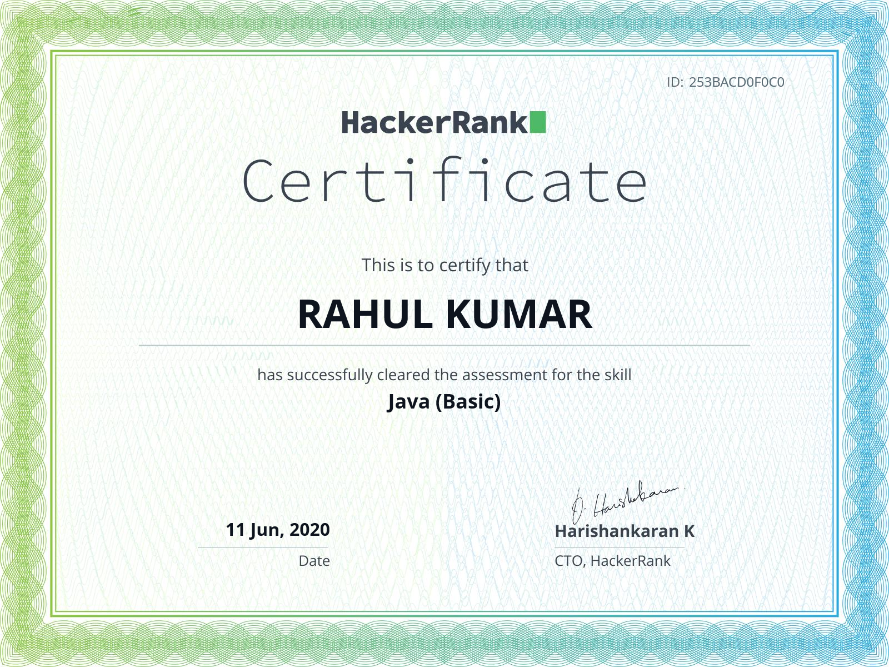
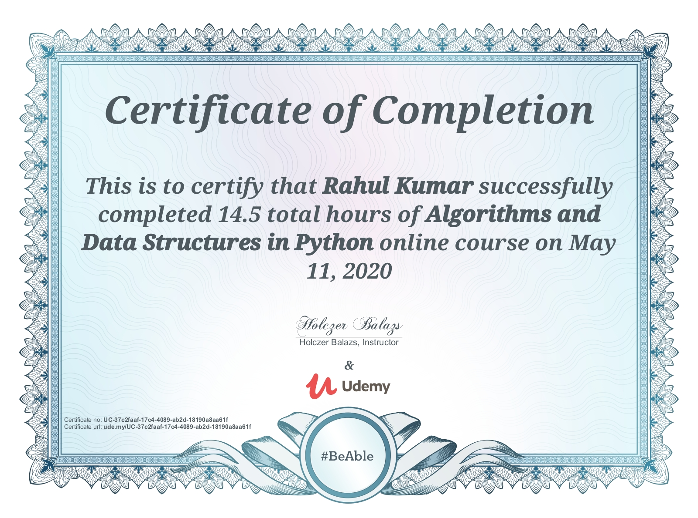
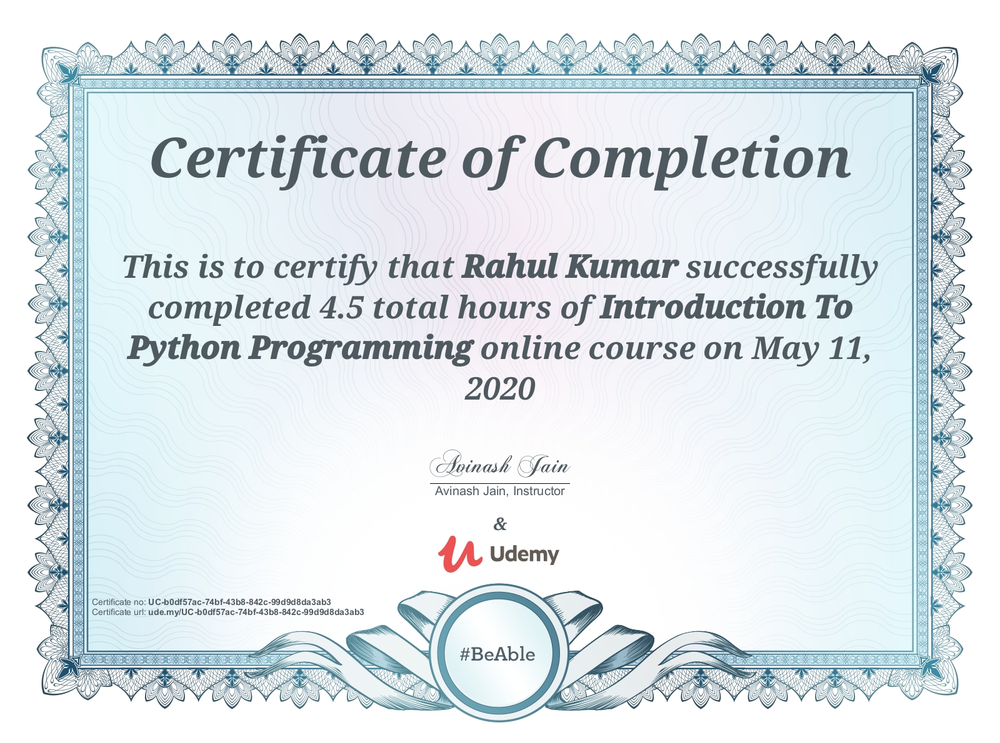

# RAHUL KUMAR

## Summary

Fullstack AI Engineer with about 2.5 years professional experience and over 4 years of academic experience in the field of artificial intelligence. Major works in computer vision and sensor timeseries data. Excellence in statistical and mathematical understanding of underlying concepts and problems in AI.

---

## Experience

- ### [Samsung R&D Institute India](https://research.samsung.com/sri-n)
	**R&D Engineer**

	Worked with different AI problems, mostly with computer vision and sensor data. Dveloped end to end solutions, include complete android app, web server and on Device AI.

	📅 July 2022-Present

	🗺 Noida, India

	---
- ### [Samsung R&D Institute India](https://research.samsung.com/sri-n)
	**Intern**

	Worked with Android Studio, learnt generative AI using Cycle GAN, training for SWC.

	📅 Jan 2022-June 2022

	🗺 Noida, India

	---

---

## Education

- ### [MITx](https://micromasters.mit.edu/)

	**[MicroMasters in Statistics and Data Science](https://micromasters.mit.edu/ds/)**

	📅 2021-23

	---
- ### [BIT Sindri](https://www.bitsindri.ac.in/)

	**[B.Tech Computer Science](https://www.bitsindri.ac.in/index.php/departments/computer-science-engineering)**

	📅 2018-22

	---
- ### [Guru Gobind Singh Public School](https://www.ggpsbokaro.org/)

	**[Higher Secondary Education]()**

	📅 2015-17

	---
- ### [ARS Public School](http://www.arspublicschool.com/)

	**[High School]()**

	📅 2008-15

	---
- ### [Sharswati Sishu Vidya Mandir]()

	**[Elementary School]()**

	📅 2005-08

	---

---

## Projects

1.	### Knox Capture

	
Developed a solution to scan damaged barcode on phone. Involved synthetic dataset generation and computer vision.

	___
2.	### SRIN-Satyapan

	
Anti-Cheat proctored exam solution. Complete Backend Server, Android App and Web Portal. Face Recognition based candidate login, malpractice detection using missing person, multiple person detection, other person detection, distraction detection.

	___
3.	### Face Recognition

	
Developed a solution for real-time multiple face recognition in live camera frames. Also developed desktop app for offline videos, and surveillance system.

	___
4.	### Distraction Detection

	
Solution to detect whether person sitting in front of screen is paying attention or distracted. Based on facial expressions, eye movement, yawn detection, head pose and face detection.

	___
5.	### Car Crash Detection

	
Solution to detect occurence of car crash and send SOS. Used mobile sensor data and GPS and developed an algorithm using time series data analysis.

	___
6.	### Drop Detection

	
Phone drop detection, height estimation, collision surface classification, drop/catch verification.

	___
7.	### [PacMan AI](https://inst.eecs.berkeley.edu/~cs188/sp21/project1/)

	
AI based intelligent agent to control pacman in different environments.              The pacman plays against the ghosts and tries to eat all food while staying safe from ghosts              and finishing in minimum time.             The pacman uses different methods like A* Search, Heuristics, Reinforcement Learning with different parameters. 

	[code](https://github.com/stopslavery404/CS188-AI/tree/main/proj1-search-python3)

	___
8.	### Automatic Review Analyzer

	
Sentiment Analysis for customer reviews. Using simple perceptron algorithm

	[code](https://github.com/stopslavery404/Machine-Learning/tree/main/Project1/sentiment_analysis)

	___
9.	### MNIST Digit Recognition

	
Classification of digits using support vector machine and gradient descent.

	[code](https://github.com/stopslavery404/Machine-Learning/tree/main/Project2/mnist/part1)

	___
10.	### Overlapping Digit Recognition

	
Classification of overlapping digits which contain multiple digits in single image, where a digit is written over other digit, using Convolutional Neural Networks. 

	[code](https://github.com/stopslavery404/Machine-Learning/tree/main/Project2/mnist/part2-twodigit)

	___
11.	### Collaborative Filtering via Gaussian Mixtures

	
Recommender system for Netflix using Gaussian Mixtures models and EM algorithm.          Ratings of few users for different movies are provided as input and ratings for movies for which         user has not rated is calculated. It achieves very nice accuracy.

	[code](https://github.com/stopslavery404/Machine-Learning/tree/main/project4/resources_netflix/netflix)

	___
12.	### Text game using Reinforcement Learning

	
It is a game in which a robot is given task in a room and he learns to play it.             Implementations using Q learning, Q learning with approximations, using neural networks to reduce the exponential size Q Tables.

	[code](https://github.com/stopslavery404/Machine-Learning/tree/main/project5/rl)

	___
13.	### Maze Solver

	
Demonstration of complexity, speed, effectiveness of different search algorithms 

	[code](https://github.com/stopslavery404/Artificial-Intelligence)

	___
14.	### [Degrees](https://cs50.harvard.edu/ai/2020/projects/0/degrees/)

	
Calculation of minimum degree of separation between actors in holywood.             Separation is in terms of working together.

	[code](https://github.com/stopslavery404/Artificial-Intelligence/tree/main/degrees)

	___
15.	### [Tic-Tac-Toe AI](https://www.youtube.com/watch?v=tp9DjqV_KoU)

	
MiniMax and Alpha-Beta pruning based undefeatable Intelligent to play against human.

	[code](https://github.com/stopslavery404/Artificial-Intelligence/tree/main/tictactoe)

	___
16.	### [Minesweeper AI](https://cs50.harvard.edu/ai/2020/projects/1/minesweeper/)

	
Knowledge based Intelligent agent to play Minesweeper which reasons using preposotional logic.

	[code](https://github.com/stopslavery404/Artificial-Intelligence/tree/main/minesweeper)

	___
17.	### [CSP solver for Crossword Puzzle](https://cs50.harvard.edu/ai/2020/projects/3/crossword/)

	
Solves Crossword puzzles by modelling it into Constraint satisfaction problem and then using         backtracking search with different heuristics to improve performance

	[code](https://github.com/stopslavery404/Artificial-Intelligence/tree/main/crossword)

	___
18.	### [Pabilistic models for reasoning under uncertainity](https://cs50.harvard.edu/ai/2020/projects/2/)

	
To demonstrate page ranking and gene inheritance, by sampeling and using bayes-net

	[code](https://github.com/stopslavery404/Artificial-Intelligence/tree/main/probabilistic%20models)

	___
19.	### [Shopping](https://cs50.harvard.edu/ai/2020/projects/4/shopping/)

	
K Nearest Neighbour model to predict whether customer will make the purchase or not.

	[code](https://github.com/stopslavery404/Artificial-Intelligence/tree/main/shopping)

	___
20.	### [NIM](https://cs50.harvard.edu/ai/2020/projects/4/nim/)

	
Playing NIM against human. Trained using reinforcement learning.

	[code](https://github.com/stopslavery404/Artificial-Intelligence/tree/main/nim)

	___
21.	### [Traffic Sign classification](https://cs50.harvard.edu/ai/2020/projects/5/traffic/)

	
CNN model for 43 class classification of traffic sign boards

	[code](https://github.com/stopslavery404/Artificial-Intelligence/tree/main/traffic)

	___
22.	### [CS50 Wiki](https://mycs50wiki.herokuapp.com/)

	
Mini version of WikiPedia with almost all features of wikipedia.          Built using django, html, jinja, css, saas.

	___
23.	### [HomePage](https://stopslavery404.herokuapp.com/)

	
My Homepage which contails details about me like hobbies, interests, and many things more.          Built using flask, HTML, CSS, Javascript.         

	___
24.	### [CS50-Finance](https://mycs50finance.herokuapp.com/)

	
A lite app to get quotes of stocks and to perform buy, sell stocks.          Technologies used: Flask, SQL, APIs, JSON, Heroku, GIT.         

	___

---

## Achievements

- **MD Appreciation Award** [Honoured with MD Appreciatioin award by honourable MD at Samsung Research, Noida, for developing SRI-N Satyapan.]()
- **Implemented van Emde Boas Tree** [1st time correct implementation in python in the History](https://github.com/stopslavery404/van-Emde-Boas-Tree)
- **World Programming Championship - IIT Mumbai** [Rank 69 | Certificate no 99695]()
- **Gold in HackFest 2020** [Rank 29 | 8051  Rating 2042.08 from 1500](https://www.hackerrank.com/results/hackerrank-hackfest-2020/stopslavery404)
- **GATE 2021** [Got AIR 5648](/static/gate2021.png)
- **CodeVita Season 9** [Cleared Round 1 with Rank 1042]()
- **CodeVita Season 9** [Got International 242 in Round 2]()
- **CodeVita Season 10** [Got International 426 in Round 1]()
- **Hack the Interview III** [Rank(73 | 919)](https://www.hackerrank.com/results/hack-the-interview-iv/stopslavery404)
- **Hack the Interview IV (Asia Pacific)** [Rank(100 | 4353)](https://www.hackerrank.com/results/hack-the-interview-iv-apac/stopslavery404)
- **Hack the Interview IV (U.S.) ** [Rank( 65 | 1217) ](https://www.hackerrank.com/results/hack-the-interview-iv/stopslavery404?h_r=profile)
- **Hackerrank Algorithms** [Rank 1026/ 2219538](https://www.hackerrank.com/leaderboard?filter=stopslavery404&filter_on=hacker&page=1&track=algorithms&type=practice)
- **Hackerrank Data Structures ** [Rank 540| 931788](https://www.hackerrank.com/leaderboard?filter=stopslavery404&filter_on=hacker&page=1&track=data-structures&type=practice)
- **Hackerrank Python Practice** [Rank 1](https://www.hackerrank.com/leaderboard?filter=stopslavery404&filter_on=hacker&page=1&track=python&type=practice)

---

## Certifications

|||||
|:----:|:----:|:----:|:----:|
|[MIT Data Analysis: Statistical Modelling and Computation in Application](https://courses.edx.org/certificates/bf4ea7cb34a742cea00c770801d1947d) |[MIT Fundamentals of Statistics](https://courses.edx.org/certificates/3c59035943454549990f2d2de7f49e9f) |[MIT Probability - The Science of Uncertainity](https://courses.edx.org/certificates/45213294fe2649c5a5954e4c42a70f13) |[MIT Machine Learning with Python-From Linear Models to Deep Learning](https://courses.edx.org/certificates/8cbde197f6874661ab8794d753f9fd7b) |
|[CS50 Introduction to Artificial Intelligence with Python](https://cs50.harvard.edu/certificates/2b1773c1-473d-4a7b-89ae-460d23154126) |[IBM Introductioin to AI](https://www.coursera.org/account/accomplishments/certificate/UA73U5EJC6XJ) |[IBM Python for Data Science, AI & Development](https://www.coursera.org/account/accomplishments/verify/YSE63GF4U76Q) |[Udemy Complete 2020 Data Science & Machine Learning Bootcamp](http://ude.my/UC-d7c52c49-464f-4b63-a9b4-2da5d4c53ff4/) |
|[C Advanced](https://www.hackerrank.com/certificates/58d066424a1e) |[C Basic](https://www.hackerrank.com/certificates/0c61249bbe1d) |[C Intermediate](https://www.hackerrank.com/certificates/337182b9dc84) |[CSS](https://www.hackerrank.com/certificates/92d056e955d2) |
|[Java](https://www.hackerrank.com/certificates/253bacd0f0c0) |[Kaggle Intermediate Machine Learning](https://www.kaggle.com/learn/certification/pctablet505/intermediate-machine-learning) |[Kaggle Intro to Deep Learning](https://www.kaggle.com/learn/certification/pctablet505/intro-to-deep-learning) |[Kaggle Intro to Machine Learning](https://www.kaggle.com/learn/certification/pctablet505/intro-to-machine-learning) |
|[Kaggle Python](https://www.kaggle.com/learn/certification/pctablet505/python) |[Problem Solving Advanced](https://www.hackerrank.com/certificates/fc7b9af8aac8) |[Problem Solving Basic](https://www.hackerrank.com/certificates/e3c6568f71c6) |[Problem Solving Intermediate](https://www.hackerrank.com/certificates/f5bcd6aa9355) |
|[Python Advanced](https://www.hackerrank.com/certificates/6e9c190da189) |[Python Basic](https://www.hackerrank.com/certificates/93d10484c124) |[Python Intermediate](https://www.hackerrank.com/certificates/9ecfb2a355a2) |[SQL Basic](https://www.hackerrank.com/certificates/2508bf1f2b12) |
|[SQL Intermediate](https://www.hackerrank.com/certificates/74470a9fe364) |[Udemy Data Structures and Algorithms](https://www.udemy.com/certificate/UC-37c2faaf-17c4-4089-ab2d-18190a8aa61f/) |[Udemy Python](https://www.kaggle.com/learn/certification/pctablet505/intermediate-machine-learning) |

---

## Contact

- **Phone** [+91-8709253658](tel:+91-8709253658)
- **Mail** [pctablet505@gmail.com](mailto:pctablet505@gmail.com)
- **LinkedIn** [@stopslavery404](https://www.linkedin.com/in/stopslavery404)
- **Website** [https://github.com/stopslavery404/portfolio](https://github.com/stopslavery404/portfolio)
- **Hackerrank** [@stopslavery404](https://www.hackerrank.com/stopslavery404)
- **GitHub** [@stopslavery404](https://www.github.com/stopslavery404)
- **Instagram** [@hello._world_.me](https://www.instagram.com/hello._world_.me)
- **Youtube** [YouTube](https://www.youtube.com/channel/UCnRPtPB_CXs1ngGlwKqP-yw)

---

